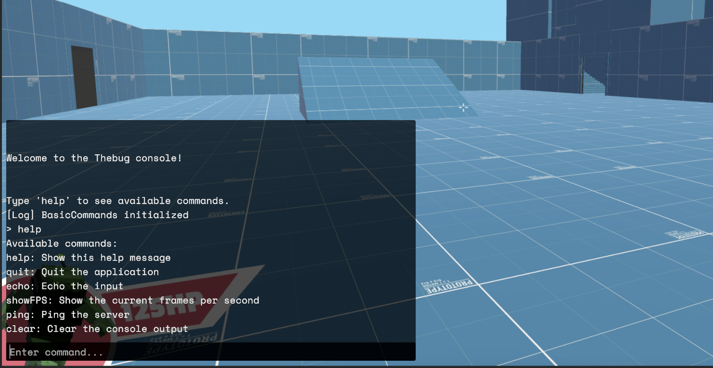
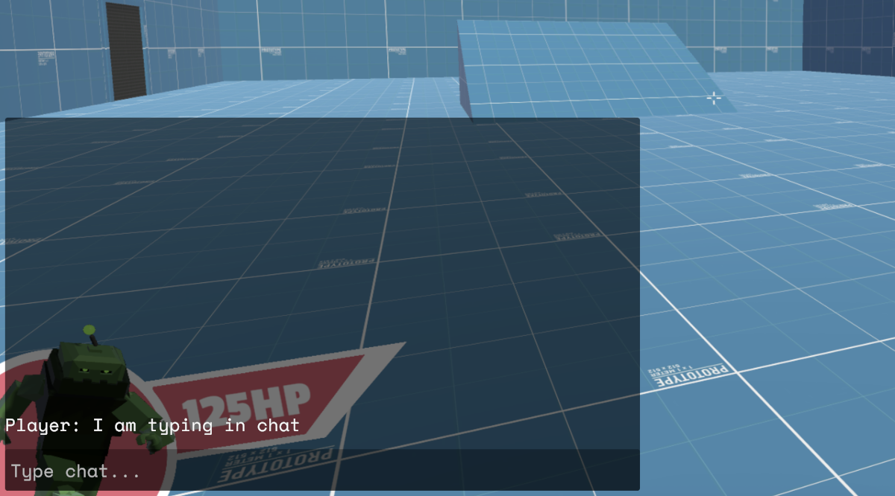

# Debug Console for Unity

_A custom, extensible in-game debug console for Unity projects._

---

## Overview

The Debug Console is a modular, expandable tool for Unity that provides a powerful interface for monitoring, debugging, and interacting with your game at runtime. Designed for easy integration and extension, it helps developers streamline testing and debugging workflows.

---

## Features

- **Real-time Debugging:**  
  View logs, warnings, and errors as they happen in-game.

- **Command Execution:**  
  Input and execute custom commands to interact with your game without code changes.

- **Expandable Architecture:**  
  Easily add new commands, tools, or UI modules to fit your project’s needs.

---

## Architecture

- **Console Input:**  
  Type commands directly into the in-game UI.

- **Output Log:**  
  Organized display of logs, warnings, and errors, with filtering options.

- **Command Parser:**  
  Interprets and executes user commands.

- **Expandable Modules:**  
  Add new features or commands without modifying the core system.

---

## Getting Started

1. **Download the Asset:**  
   Head to the Release section of the repository and download the latest version of the asset. Alternatively, you can clone the repository.

2. **Import the Asset:**  
   Import the TheBugConsole.unitypackage to your Unity project.

3. **Setup:**  
   - Assign the required prefabs (console, chat) in the `WindowManager` script.
   - Optionally, use your own window manager.

4. **Usage:**  
   - Open the console or chat using the configured key bindings.
   - Type commands to interact with your game.

---

## Usage Example

- Adjust player speed:
- Spawn an enemy:

---

## Extending the Console

1. **Define a Command:**  
   Create a new script and use the provided attribute to register your command.

2. **Implement Logic:**  
   Write the logic for your command in the script.

3. **Register:**  
   The console will automatically detect and register new commands at runtime.

---

## Screenshots

**1. Console UI in Action**  
_The in-game debug console displaying logs and accepting commands:_

**2. Chat Template Example**  
_Example of the simple a chat:_

---

## License

MIT License. See `LICENSE` for details.

---

_Created by Shelstad Studios_